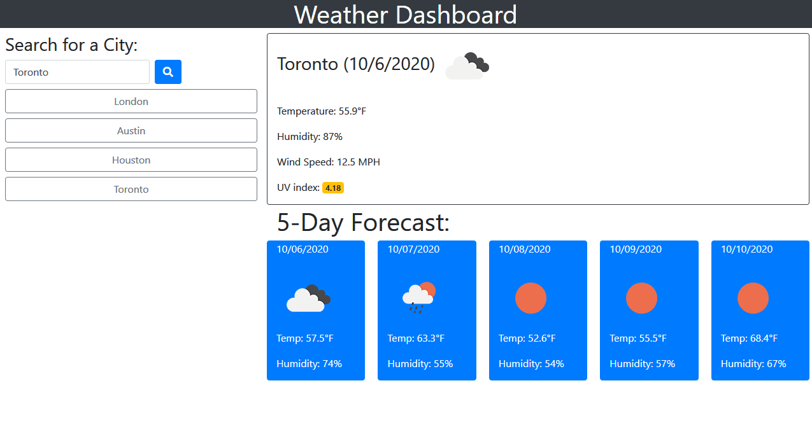

# Weather-Dashboard

This application retrieves data from the openweathermap API. The objects retreived from openweathermap have different purposes such as showing the current weather, the 5-day forecast, the UVindex, etc. I was tasked with making a webpage that shows the data through dinamically updated html and css. 

When users first arrive at the webpage they will search for a city. After they hit the search button, weather data for that city is displayed. The current conditions show the temperature, humidity, wind speed, and the UV index. The UV index is color coded to show the severity of the value. For example, a UV index value of 10 will be red, representing danger. A UV index value of 2 will be green, representing safety.

The 5-day forecast shows the date, temperature, and humidity. 

The webpage is styled using bootstrap. The openweathermap also has icons that are used to add personality to the page. 

Users can save multiple cities in the local storage and as a button on the page. The city's info will be displayed again when they click on the respective button. Beware closing the browser may delete that local storage.

The application is deployed at https://26rsuarez.github.io/Weather-Dashboard/

